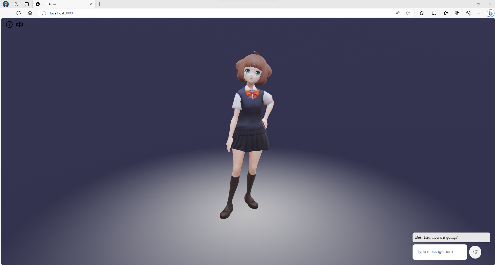

# GPT ANIME CHATBOT

Hello everyone,  the purpose of this repository is to create  beautiful 3D chatbot with ChatGPT.

Some times when you are watching anime and you liked the character, you can think if you can speak with your favorite cartoon character or a simple favorite  AI model Gideon of  the TV series DC's Legends of Tomorrow

In this repository we will explain how to install 
this chatbot. 

This is a repo for the [gpt-anime project.](https://www.gpt-anime.com/)

## Setup

1. **Install npm** - [nvm](https://github.com/nvm-sh/nvm#installing-and-updating) and node version 18.14.2 are recommended 

We are going to use ubuntu to run this app. If you have windows you can just install 

```
bash
```

```
sudo apt apt-get update
```

```
sudo apt install npm 
```

```
sudo apt install curl 
```

```
curl https://raw.githubusercontent.com/nvm-sh/nvm/v0.39.3/install.sh | bash
```

```
source ~/.bashrc
```

```
nvm install node
```


```
nvm install v18.14.2
```


2. **Make sure npm is installed**. To check if it's installed you can run 

```
npm -v
```


3. **Install yarn** 

```
npm install  --global yarn
```


## [How to run the project]()

1. Clone the repository
2. Add API keys to `.env.local` file

```
cp .env env.local

```
Paste your  OpenAI API key  by adding the OPENAI_API_KEY env var in the `.env.local` file.

Add a Google Cloud API key by adding the GOOGLE_API_KEY env var in the `.env.local`file.

3. **Install the dependencies** - In the root folder of this project  Run 

```
yarn install
```
to install the dependencies


4. **Run the project** -  In the root folder of this project , 

Run the following command
```
yarn web
```
to start the web server


5. Navigate to [http://localhost:3000](http://localhost:3000) to view the project





6. Custom run (optional)
If you want to run with optimizer on in dev mode (just for testing, it's faster to leave it off):  

```
yarn web:extract
```

To build for production 

```
yarn web:prod
```

To see debug output to verify the compiler, add `// debug` as a comment to the top of any file.

Additional [notes](./notes/README.md)

# Custom Addons

