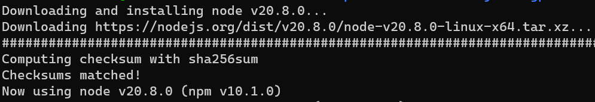
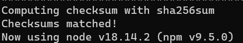
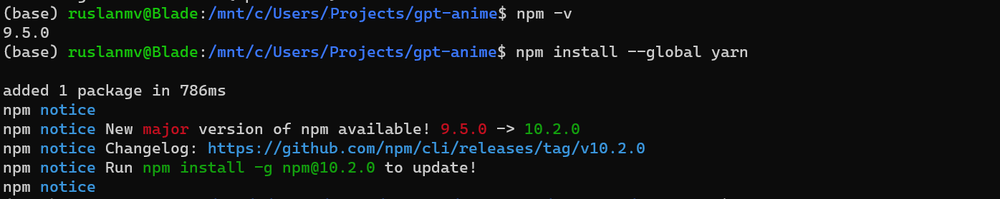
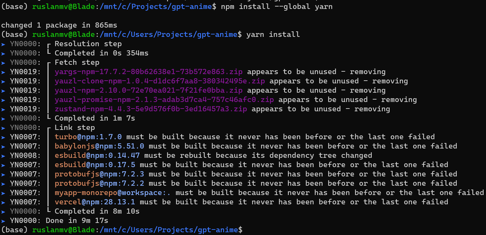

# GPT ANIME CHATBOT

Hello everyone,  the purpose of this repository is to create  beautiful 3D chatbot with ChatGPT.

Some times when you are watching anime and you liked the character, you can think if you can speak with your favorite cartoon character or a simple favorite  AI model Gideon of  the TV series [DC's Legends of Tomorrow.](https://en.wikipedia.org/wiki/Legends_of_Tomorrow) 

In this repository we will make this possible.

This is a repo for the [gpt-anime project.](https://www.gpt-anime.com/)

## Setup

An OpenAI API key is required. Check out the OPENAI_API_KEY env var in the .env file.

A Google Cloud API key is required. Check out the GOOGLE_API_KEY env var in the .env file.

1. **Install npm** - [nvm](https://github.com/nvm-sh/nvm#installing-and-updating) and node version 18.14.2 are recommended (this is the LTS version as of June 25 2023)

   We are going to use ubuntu to run this app. If you have windows you can just install 

   ```
   bash
   ```

   ```
   sudo apt apt-get update
   ```

   ```
   sudo apt install npm 
   ```

   ```
   sudo apt install curl 
   ```

   ```
   curl https://raw.githubusercontent.com/nvm-sh/nvm/v0.39.3/install.sh | bash
   ```

   ```
   source ~/.bashrc
   ```

   ```
   nvm install node
   ```

   

   ```
   nvm install v18.14.2
   ```

   

2. **Make sure npm is installed**. To check if it's installed you can run 

   ```
   npm -v
   ```

   

3. **Install yarn** 

   ```
   npm install  --global yarn
   ```

   

4. **Install the dependencies** - In the root folder of this project  run 

   ```
    yarn install
   ```

   

   

5. **Run the project** -  In the root folder of this project , run 

   ```
   yarn web
   ```

   

   To run with optimizer on in dev mode (just for testing, it's faster to leave it off): ``. 

   ```
   yarn web:extract
   ```

   To build for production 

   ```
   yarn web:prod
   ```

   To see debug output to verify the compiler, add `// debug` as a comment to the top of any file.

   - Expo local dev: `yarn native`

# Android & iOS

In the apps/expo directory there's code to run this project on Android and iOS. It's currently not working, and I have no plans to fix it atm.

# Native & web env vars

- Setting up env vars for both native and web is a little different than usual. See TAMAGUI_TARGET for an example.

# Jest

Run individual test files with:

npx jest path/to/testFile.test.ts --watch

e.g. go into the apps/next folder, and run:

npx jest lib/babylonjs/\_\_tests\_\_/utils.test.ts --watch

# Model

The model used in this project is a [VRoid model.](https://vroid.com/en/studio)

For more info on how I set up the model and anims, [check out the following babylonJS forum thread.](https://forum.babylonjs.com/t/chatgpt-3d-talking-models/39801)

# Other

Reduce png image quality and size:

pngquant --quality 10-80 --speed 1 --output output_reduced0.png --force Image_0.png


References:

It was built with the [next+expo+solito starter template.](https://github.com/tamagui/tamagui/tree/master/starters/next-expo-solito)

## [How to run the project]()

1. Clone the repository
2. Add API keys to `.env.local` file
3. Run `yarn install` to install the dependencies
4. Run `yarn dev` to start the development server
5. Navigate to `localhost:3000` to view the project
