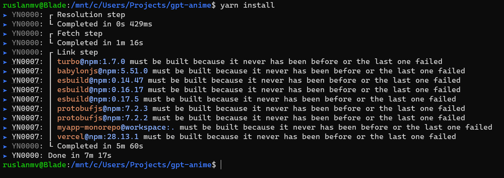

# GPT ANIME CHATBOT

Hello everyone,  the purpose of this repository is to create  beautiful 3D chatbot with ChatGPT.

Some times when you are watching anime and you liked the character, you can think if you can speak with your favorite cartoon character or a simple favorite  AI model Gideon of  the TV series DC's Legends of Tomorrow

In this repository we will make this possible. 

This is a repo for the [gpt-anime project.](https://www.gpt-anime.com/)

We are going to install This ChatBot on  Ubuntu 22.04  by using  Windows 11.

## Setup

1. Search for **Command Prompt**, right-click the top result, and select the **Run as administrator** option.

2. Type the following command to view a list of all available distros and press **Enter**:

   ```
   wsl --list
   ```

   **Quick tip:** You can also use this variant `wsl -l` of the command.

3. Type the following command to set the Linux distro as the new default on WSL and press **Enter**:

   ```
   wsl --setdefault DISTRO-NAME
   ```

   In the command, replace **“DISTRO-NAME”** with the name of the distro to set it as default (see **step 3**). For instance, this command makes Ubuntu Linux the default distro on Windows 11:

   ```
   wsl --setdefault Ubuntu-22.04
   ```

We are going to use ubuntu to run this app. If you have windows you can just install 

```
bash
```

```
sudo apt-get update
```

```
sudo apt install build-essential
```


## Add NodeSource PPA

ENter the following command which will add the PPA sources for NodeJS 18 on your Ubuntu 22.04 installation:

```bash
sudo apt-get update
sudo apt-get install -y ca-certificates curl gnupg
sudo mkdir -p /etc/apt/keyrings
curl -fsSL https://deb.nodesource.com/gpgkey/nodesource-repo.gpg.key | sudo gpg --dearmor -o /etc/apt/keyrings/nodesource.gpg
```

## Install NodeJS 18

In the previous step, we added the PPA source. This allows the APT package manager to install NodeJS 18 on our Ubuntu 22.04 installation. Run the following command:

```
NODE_MAJOR=18
echo "deb [signed-by=/etc/apt/keyrings/nodesource.gpg] https://deb.nodesource.com/node_$NODE_MAJOR.x nodistro main" | sudo tee /etc/apt/sources.list.d/nodesource.list
```

```bash
sudo apt-get update
sudo apt-get install nodejs -y
```

##  Confirm the installed version of NodeJS

Finally, let's check to see the version of NodeJS installed is 18.x as expected. Run the following command:

```bash
node -v
```

We should see an output that confirms the version of NodeJS being 18.x on our Ubuntu 22.04 installation.


```
sudo apt install curl 
curl https://raw.githubusercontent.com/creationix/nvm/master/install.sh | bash 
```

```
source ~/.profile 
```

For updates visit this [repo](https://github.com/nodesource/distributions)

```
nvm install v18.14.2
```


1. **Make sure npm is installed**. To check if it's installed you can run 

   ```
   npm -v
   ```

   

2. **Install yarn** 

   ```
   npm install  --global yarn
   ```

   

3. **Install the dependencies** - In the root folder of this project  run 

   ```
    yarn install
   ```

   

   

   **Setup credentials**

   An OpenAI API key is required. Check out the OPENAI_API_KEY env var in the .env file.

   A Google Cloud API key is required. Check out the GOOGLE_API_KEY env var in the .env file.

4. **Run the project** -  In the root folder of this project , run 

   ```
   yarn
   ```

   To run with optimizer on in dev mode (just for testing, it's faster to leave it off): ``. 

   ```
   yarn web:extract
   ```

   To build for production 

   ```
   yarn web:prod
   ```

   To see debug output to verify the compiler, add `// debug` as a comment to the top of any file.


 

# Android & iOS

In the apps/expo directory there's code to run this project on Android and iOS. It's currently not working, and I have no plans to fix it atm.

# Native & web env vars

- Setting up env vars for both native and web is a little different than usual. See TAMAGUI_TARGET for an example.

# Jest

Run individual test files with:

npx jest path/to/testFile.test.ts --watch

e.g. go into the apps/next folder, and run:

npx jest lib/babylonjs/\_\_tests\_\_/utils.test.ts --watch

# Model

The model used in this project is a [VRoid model.](https://vroid.com/en/studio)

For more info on how I set up the model and anims, [check out the following babylonJS forum thread.](https://forum.babylonjs.com/t/chatgpt-3d-talking-models/39801)

# Other

Reduce png image quality and size:

pngquant --quality 10-80 --speed 1 --output output_reduced0.png --force Image_0.png


References:

It was built with the [next+expo+solito starter template.](https://github.com/tamagui/tamagui/tree/master/starters/next-expo-solito)

## [How to run the project]()

1. Clone the repository
2. Add API keys to `.env.local` file
3. Run `yarn install` to install the dependencies
4. Run `yarn dev` to start the development server
5. Navigate to `localhost:3000` to view the project
